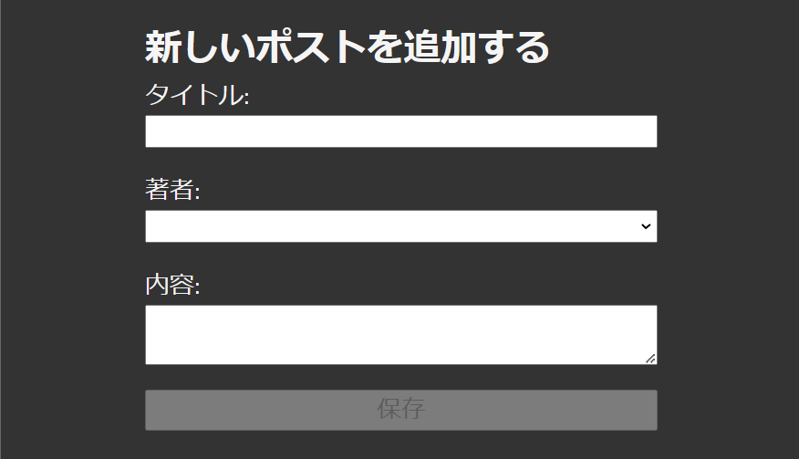
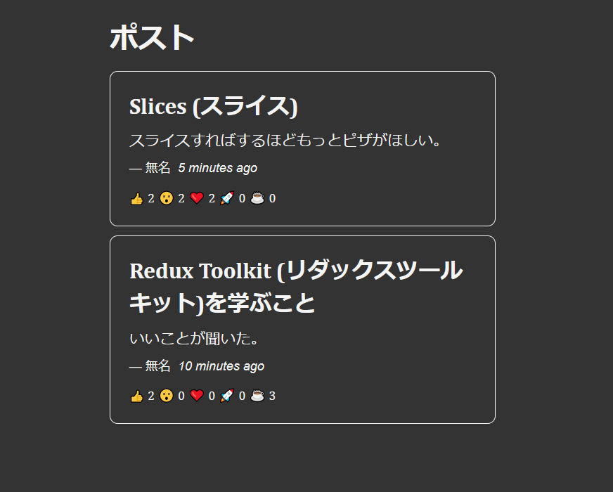

# Chapter 2

This chapter focused on diving deeper with the basic structure and data flow of Redux Toolkit through an example project.

The project is a simple blog post application wherein a user can add a post and add reactions as well.

## Add Post

## Posts

Topics covered:
* Creating and Exporting Selectors
* `prepare` callback in Reducers
* Role of Immer.js in createSlice method
